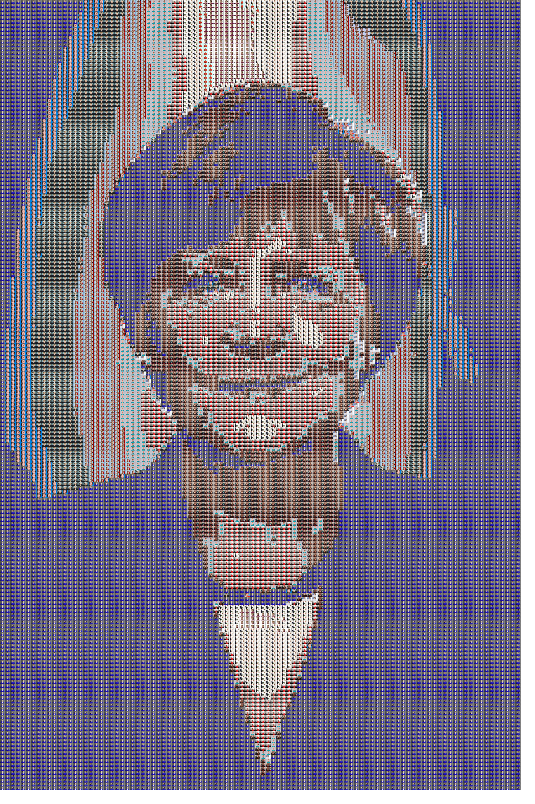
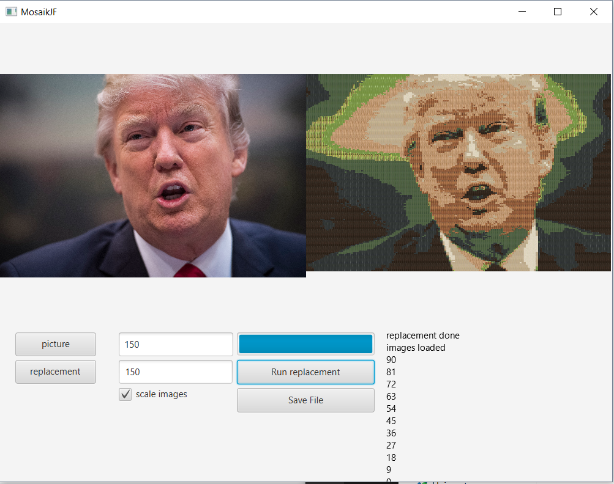

# mosaik

A tool to create mosaiks from jpgs, by splitting a given image in x*y chunks and replacing those chunks with the closest match from a number of replacement images.
Has a GUI, if you like that sort of thing...

Originl | Mosaik
---|---
 | 

